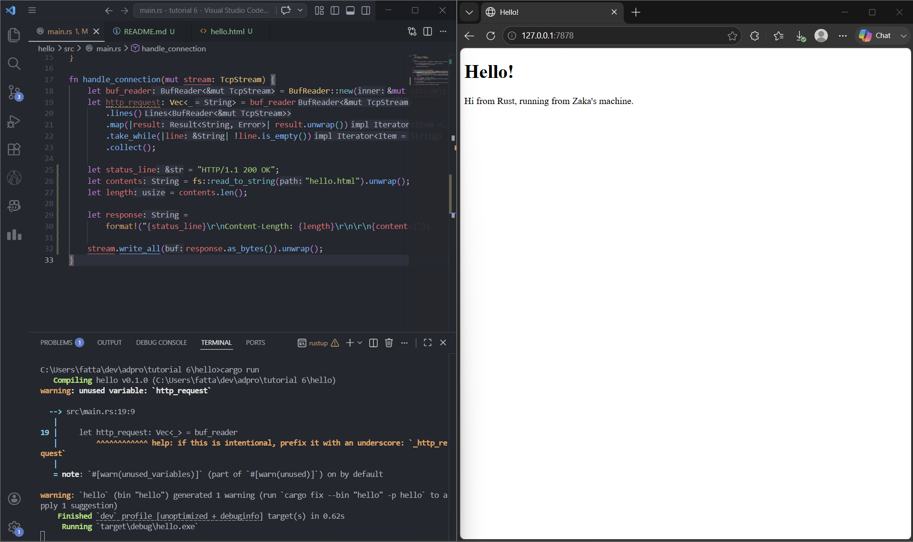
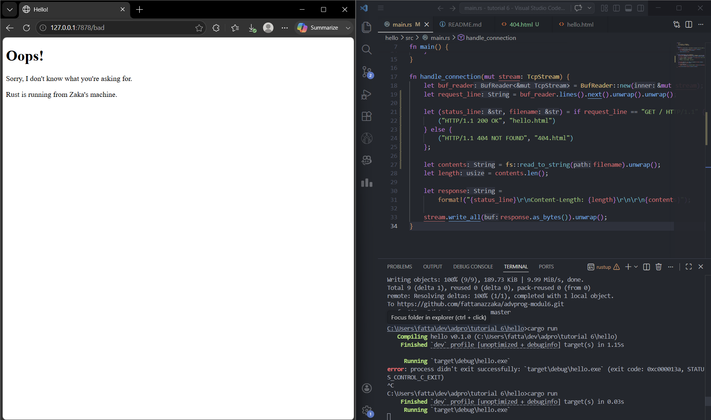

## Commit 1 Reflection Notes

Pada milestone pertama, saya mempelajari cara membuat web server sederhana menggunakan Rust.
Fungsi handle_connection menerima parameter TcpStream yang merepresentasikan koneksi
TCP dari browser ke server.

Di dalam fungsi tersebut, BufReader digunakan untuk membungkus stream agar bisa dibaca
baris per baris secara efisien. Method .lines() menghasilkan iterator atas setiap baris dari
HTTP request, .map() digunakan untuk meng-unwrap setiap Result<String> menjadi String,
dan .take_while(|line| !line.is_empty()) digunakan untuk berhenti membaca ketika menemukan
baris kosong — karena dalam protokol HTTP, header diakhiri dengan baris kosong.

Hasil akhirnya adalah Vec<String> yang berisi seluruh baris HTTP request header yang
dikirimkan oleh browser, seperti method (GET), path, versi HTTP, Host, User-Agent, dll.
Ini menunjukkan bahwa komunikasi antara browser dan server menggunakan format HTTP standar.

## Commit 2 Reflection Notes

Pada milestone kedua, saya memodifikasi handle_connection agar dapat mengirimkan respons
HTML ke browser. Beberapa hal baru yang saya pelajari:

Pertama, fs::read_to_string("hello.html") digunakan untuk membaca isi file HTML menjadi
sebuah String. File ini harus berada di direktori yang sama dengan tempat kita menjalankan
cargo run.

Kedua, respons HTTP memiliki format tertentu: diawali dengan status line (HTTP/1.1 200 OK),
diikuti header seperti Content-Length yang memberi tahu browser ukuran body dalam bytes,
kemudian dua baris kosong sebagai pemisah antara header dan body, dan terakhir
body berupa isi HTML. Tanpa Content-Length yang benar, browser mungkin tidak dapat
merender halaman dengan benar.

Ketiga, stream.write_all(response.as_bytes()) digunakan untuk mengirim response sebagai
bytes melalui TCP stream ke browser.

## Commit 3 Reflection Notes

Pada milestone ketiga, server kini mampu membedakan request yang valid dan tidak valid.
Perubahan utama ada pada cara handle_connection membaca request: alih-alih mengumpulkan
semua baris header ke dalam Vec, kita hanya mengambil baris pertama saja menggunakan
.next().unwrap().unwrap(). Baris pertama inilah yang disebut request line, contohnya
GET / HTTP/1.1, yang berisi method HTTP, path yang diminta, dan versi protokol.

Server kemudian melakukan pengecekan: jika request line adalah GET / HTTP/1.1, maka
server merespons dengan status 200 OK dan mengirimkan hello.html. Jika bukan (path
apapun selain /), maka server merespons dengan status 404 NOT FOUND dan mengirimkan
404.html.

Refactoring diperlukan karena sebelumnya kode untuk menentukan status line dan filename
ada duplikasi di dalam blok if-else (dua kali pemanggilan fs::read_to_string dan
stream.write_all). Dengan refactoring, kita ekstrak hanya bagian yang berbeda (status_line
dan filename) ke dalam tuple hasil if-else, sehingga bagian pembacaan file dan penulisan
response hanya ditulis sekali. Ini mengikuti prinsip DRY.

## Commit 4 Reflection Notes

Pada milestone keempat, saya mensimulasikan kelemahan single-threaded server dengan
menambahkan endpoint /sleep yang membuat thread utama tidur selama 10 detik sebelum
memberikan respons.

Ketika saya membuka dua tab browser, satu ke /sleep dan satu lagi ke / tab kedua
tidak langsung mendapat respons meskipun request-nya sederhana. Ini terjadi karena server
hanya memiliki satu thread, sehingga hanya bisa menangani satu koneksi dalam satu waktu.
Selama thread sedang menjalankan thread::sleep untuk request /sleep, semua request lain
harus mengantri dan menunggu giliran.

Ini adalah masalah serius di dunia nyata: bayangkan ribuan pengguna mengakses server
secara bersamaan. Jika satu request lambat, seluruh pengguna lain akan terdampak. Inilah
motivasi utama mengapa kita perlu multithreading atau concurrency pada web server.